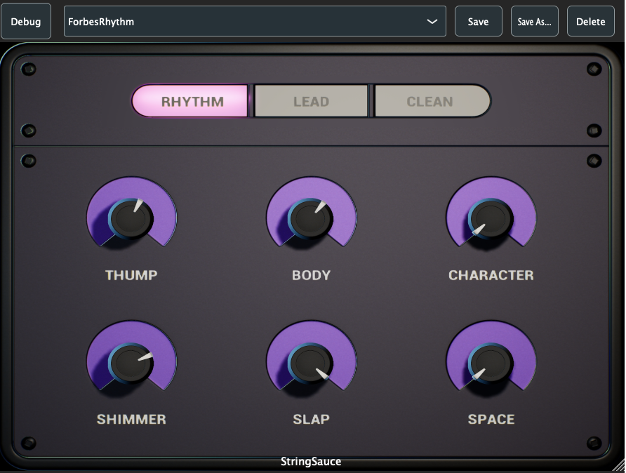

# StringSauce — A Semantic Guitar-Bus Audio Plugin (JUCE / C++)

StringSauce is a multi-stage guitar bus processor built in modern C++ using the JUCE framework.  
It combines EQ, dynamics, saturation, spatial processing, and mode-dependent behavior into a single macro-driven interface designed for real-time performance.  

---

## ✨ Features

### 🎛 Macro-Driven Tone Engine
A custom **ToneEngine** maps six high-level musical descriptors into dozens of low-level DSP parameters:

- **Character**
- **Thump**
- **Body**
- **Shimmer**
- **Slap**
- **Space**

These feed directly into EQ, compression, transient shaping, saturation, delay, chorus, reverb, and stereo-width processors via the [`ParameterMapper`](./Source/ParameterMapper.hpp).

---

## 🧩 DSP Architecture

### 1. **EQ Section**
Multi-band, mode-aware EQ with safe coefficient generation and dynamic frequency/gain/Q mapping.  
See [`EQProcessor.cpp`](./Source/EQProcessor.cpp) for implementation details.  

### 2. **Dynamics Processor**
Includes broadband compression, transient shaping, and a frequency-adaptive de-esser path.  
Dynamic envelopes, makeup gain, and mode-dependent time constants.  
[`DynamicsProcessor.cpp`](./Source/DynamicsProcessor.cpp)

### 3. **Saturation Processor**
Oversampled waveshaping with multiple models (Tape, Tube, Transistor, Exciter).  
Bias control, tone filtering, and dry/wet handling.  
[`SaturationProcessor.cpp`](./Source/SaturationProcessor.cpp)  

### 4. **Spatial Processor**
Stereo delay, chorus, reverb, and mid/side width shaping with parameter-dependent mixing.  
[`SpatialProcessor.cpp`](./Source/SpatialProcessor.cpp) 

### 5. **Mode Processor**
Three instrument-driven processing modes:

- **Rhythm**
- **Lead**
- **Clean**

Each rearranges the DSP chain and alters parameter behaviors for more natural response.  
[`ModeProcessor.cpp`](./Source/ModeProcessor.cpp)

---

## 🖥 UI & Interaction

The plugin editor uses a modular UI system built around configurable component factories (`UIFactory`) and a normalized layout (`UILayout`). It supports:

- Custom knobs via PNG look-and-feel
- Mode buttons for switching between Rhythm/Lead/Clean
- A fully optional **debug panel** showing internal parameter mappings  

---

## 🧪 Technical Highlights

- **Oversampling** for saturation integrity  
- **Thread-safe DSP parameter smoothing**
- **APVTS parameter architecture** with host automation support  
- **Mode-dependent signal routing**
- **Real-time friendly processing**

---

## 🧰 Built With

- **C++20**
- **JUCE Framework** (dsp, GUI, plugin hosting)
- Xcode project auto-generated by JUCE
- Tested primarily in **Logic Pro** 

---

## 🔧 Current Status

Actively in development as part of a research plugin pipeline.  
Core DSP, parameter mapping, and UI architecture are implemented and stable.  
Upcoming work includes:

- Final UI artwork pass  
- Optimized SSE/AVX paths  
- Cross-platform packaging

---

## 📄 License

This project is currently closed-source and not licensed for redistribution.  
Source code here is for portfolio and demonstration purposes only.

---

## 📬 Contact

**Khris Finley**
[https://finleyaud.io](www.finleyaud.io)

